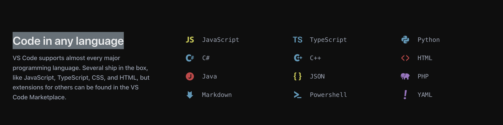

# link-quote-clip
A Chrome extension that lets you copy selected text along with the URL in a citation-friendly format for easy quoting.

## usage
1. Select text on a webpage.

2. Right-click and select "Copy selected text with link" from the context menu.

3. Paste the copied text into your document. The copied text will be in the format:
```
> ${selected text}

${link to text}
```


4. Open the link to the selected text.


